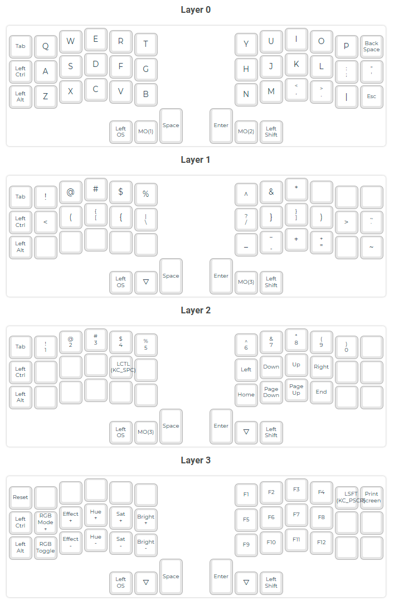

# Quantum Mechanical Keyboard Firmware

[docs](https://docs.qmk.fm)
[repo](https://github.com/qmk/qmk_firmware)
[tool](https://config.qmk.fm/#/crkbd/rev1/LAYOUT_split_3x6_3)

## Layout

Custom Overrides

```text
key     | shift + key
--------+-------------
KC_PIPE | KC_QUES
KC_BKSP | KC_DEL
```

Keyboard Layout



## Installation

```text
echo "PATH=$PATH:$HOME/.local/bin" >> $HOME/.zshrc
python3 -m pip install --user qmk
```

## New Configuration

```text
qmk setup -H $HOME/projects/git/qmk_firmware freddiehaddad/qmk_firmware
qmk new-keymap --keyboard crkbd --keymap freddiehaddad
qmk config user.keyboard=crkbd
qmk config user.keymap=freddiehaddad
```

## Existing Configuration

```text
qmk setup -H $HOME/projects/git/qmk_firmware freddiehaddad/qmk_firmware
qmk config user.keyboard=crkbd
qmk config user.keymap=freddiehaddad
```

## Flashing

```text
qmk compile --clean
qmk flash --bootloader dfu
```

## Miscellaneous

### Initial Flash

See: [Github Issue](https://github.com/qmk/qmk_firmware/issues/22050#issuecomment-1722308968)

```text
 dfu-programmer atmega32u4 erase --force
```

### Generate keymap.json

```text
qmk c2json --keyboard crkbd --keymap freddiehaddad --output keymap.json keymap.c
```
