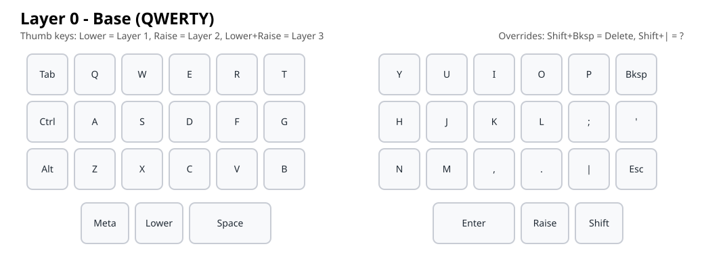
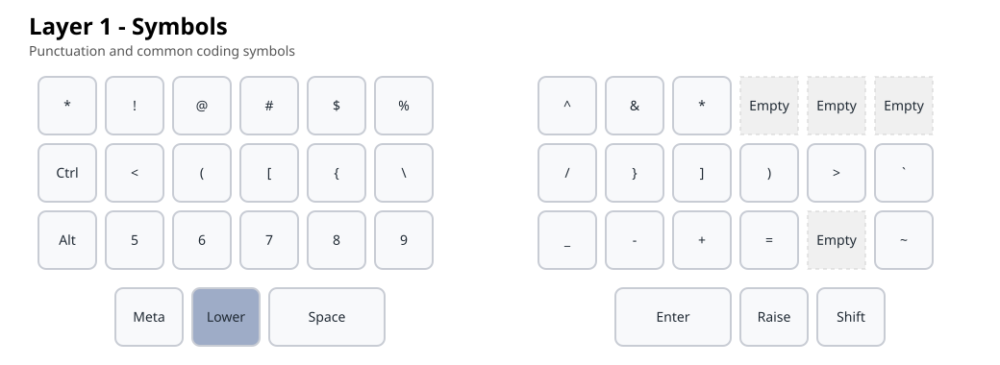
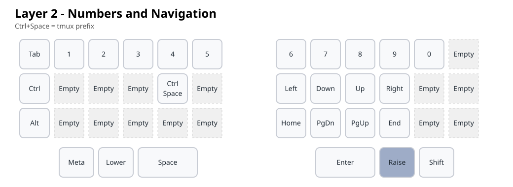
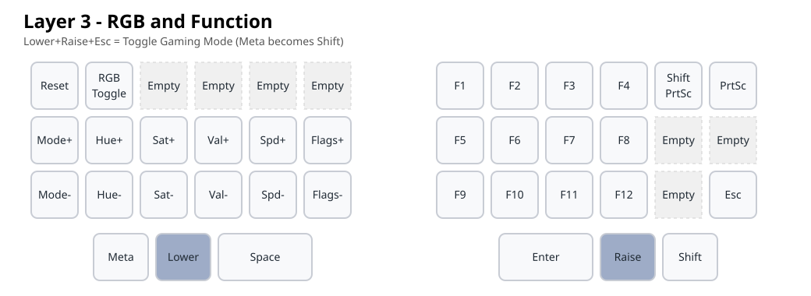

# Corne Keyboard – Custom QMK Keymap

This repository contains my custom QMK keymap for the Corne (crkbd) split keyboard. It includes advanced features like Key Overrides, Combos, and RGB Matrix controls for a highly ergonomic and customizable experience.

At a glance, the layout keeps QWERTY on the base layer, places punctuation on Lower (`MO(1)`), navigation and numbers on Raise (`MO(2)`), and parks RGB controls on `MO(3)`, while the Meta thumb key acts as GUI (Windows/Command key). Signature combos include Shift+Backspace sending Delete, Shift+| outputting ?, and the Lower+Raise+Esc chord that toggles the Meta key between GUI and Shift for gaming mode.






## Legend

- **Meta**: Left GUI (Windows/Command) key on the thumb; toggles to Shift in gaming mode
- **Lower / Raise**: Momentary layer switches `MO(1)` / `MO(2)`
- **RGB**: Thumb key that holds `MO(3)` for lighting controls
- **Ctrl+Space**: Tmux prefix
- **Shift+PrtSc**: `S(KC_PSCR)` for full-screen screenshots
- **RM_* keycodes**: RGB Matrix helpers for mode, hue, saturation, value, and speed adjustments
- **Empty**: Deliberately transparent slot that falls through to lower layers

## Features Overview

- Key Overrides
  - Shift+| = ?
  - Shift+Bksp = Delete
- Gaming Mode Toggle
  - Press Lower+Raise+Esc to toggle the Meta (GUI) thumb key between Windows/Command key (normal) and Shift (gaming mode).
  - In gaming mode, the Meta key becomes Shift to prevent accidentally opening the Start menu.
- RGB Matrix Controls
  - Layer 3 provides RGB toggle, mode, hue, saturation, brightness, speed adjustments.
- Layer Layouts
  - Base: QWERTY
  - Layer 1: Symbols
  - Layer 2: Numbers + Navigation
  - Layer 3: RGB + Function keys

## Layers Overview

| Layer | Description           |
|-------|-----------------------|
| 0     | Base QWERTY           |
| 1     | Symbols (punctuation) |
| 2     | Numbers + Navigation  |
| 3     | RGB Matrix + Function |

## Installation & Build

### Prerequisites

- Install the QMK CLI and toolchains via `qmk setup` using the [official getting-started guide](https://docs.qmk.fm/#/newbs_getting_started?id=set-up-your-environment).
- Make sure AVR GCC, `dfu-programmer`, and (if needed) `dfu-util` are on your PATH.
- Run `qmk doctor` to verify your environment before flashing.

### Quick Start

1. Clone QMK Firmware.
1. Clone this keymap.

Place this repo under:

```text
<qmk repo root>/keyboards/crkbd/keymaps/freddiehaddad
```

### Build & Flash

```console
qmk config user.keyboard=crkbd
qmk config user.keymap=freddiehaddad
qmk compile --clean
qmk flash --bootloader dfu
```

- Connect each half of the Corne when prompted during flashing.
- If the board fails to enter bootloader, hold the reset button and rerun the flash command, then check `qmk doctor` for warnings.

> **NOTE**: If initial flash fails:
>
> See: [Github Issue](https://github.com/qmk/qmk_firmware/issues/22050#issuecomment-1722308968)
>
> ```console
> dfu-programmer atmega32u4 erase --force
> ```

## Generate keymap.json

```text
qmk c2json --keyboard crkbd/rev1 --keymap freddiehaddad --output keymap.json keymap.c
```

## Maintaining the Diagrams

- SVG layouts live in `assets/` and mirror each QMK layer.
- Update the keycaps and labels whenever `keymap.c` changes so the README stays accurate.
- If you export PNGs or other variants, regenerate them from the SVG source to keep everything in sync.

## References

- [QMK Docs](https://docs.qmk.fm/)
- [RGB Matrix](https://docs.qmk.fm/features/rgb_matrix)
- [Combos](https://docs.qmk.fm/features/combo)
- [Key Overrides](https://docs.qmk.fm/features/key_overrides)
- [QMK Configurator](https://config.qmk.fm/#/crkbd/rev1/LAYOUT_split_3x6_3)
