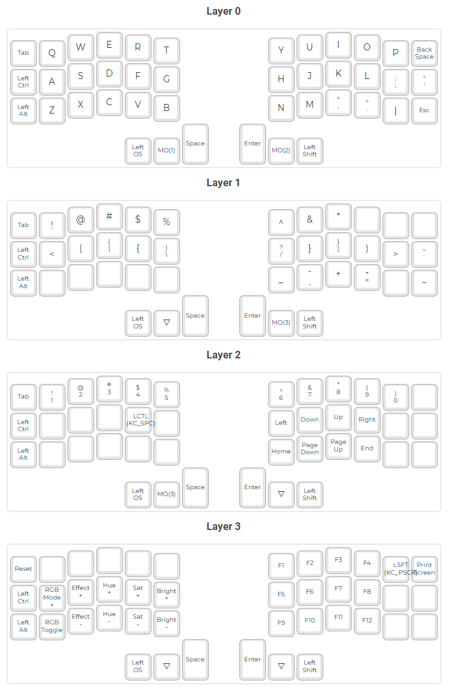

# Corne Keyboard – Custom QMK Keymap

This repository contains my custom QMK keymap for the Corne (crkbd) split
keyboard. It includes advanced features like Key Overrides, Combos, and RGB
Matrix controls for a highly ergonomic and customizable experience.



## Features Overview

- Key Overrides
  - Shift + | → ?
  - Shift + Backspace → Delete
- Win Lock Combo
  - Press Lower + Raise + Esc to toggle Windows/GUI keys globally (great for
    gaming).
- RGB Matrix Controls
  - Layer 3 provides RGB toggle, speed, hue, saturation, and brightness
    adjustments.
- Layer Layouts
  - Base: QWERTY
  - Layer 1: Symbols
  - Layer 2: Numbers + Navigation
  - Layer 3: RGB + Function keys

## Layers Overview

| Layer | Description           |
|-------|-----------------------|
| 0     | Base QWERTY           |
| 1     | Symbols (punctuation) |
| 2     | Numbers + Navigation  |
| 3     | RGB Matrix + Function |

## Installation & Build

1. Clone QMK Firmware
1. Clone This Keymap

Place this repo under:

```text
<qmk repo root>/keyboards/crkbd/keymaps/freddiehaddad
```

## Configure QMK

```console
qmk config user.keyboard=crkbd
qmk config user.keymap=freddiehaddad
qmk compile --clean
qmk flash --bootloader dfu
```

> **NOTE**: If initial flash fails:
>
> See: [Github Issue](https://github.com/qmk/qmk_firmware/issues/22050#issuecomment-1722308968)
>
> ```console
> dfu-programmer atmega32u4 erase --force
> ```

## Generate keymap.json

```text
qmk c2json --keyboard crkbd/rev1 --keymap freddiehaddad --output keymap.json keymap.c
```

## References

- [QMK Docs](https://docs.qmk.fm/)
- [RGB Matrix](https://docs.qmk.fm/features/rgb_matrix)
- [Combos](https://docs.qmk.fm/features/combo)
- [Key Overrides](https://docs.qmk.fm/features/key_overrides)
- [QMK Configurator](https://config.qmk.fm/#/crkbd/rev1/LAYOUT_split_3x6_3)
