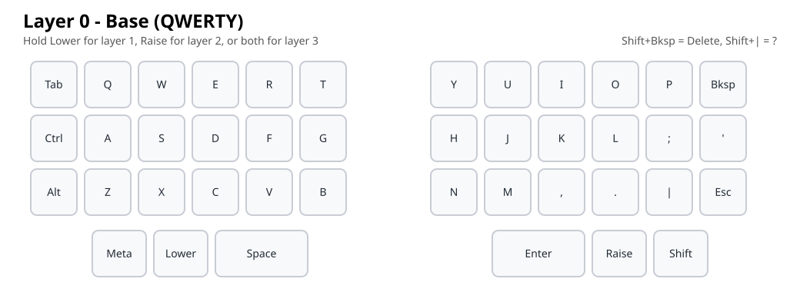
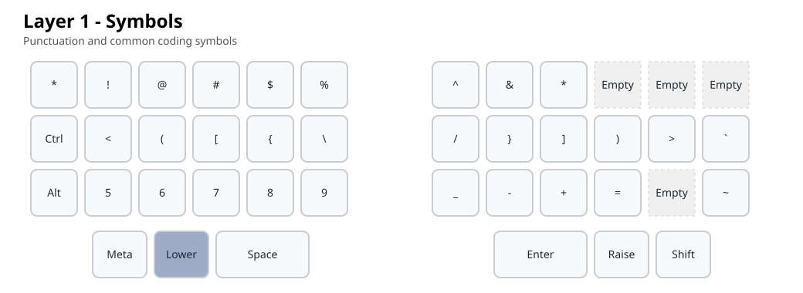
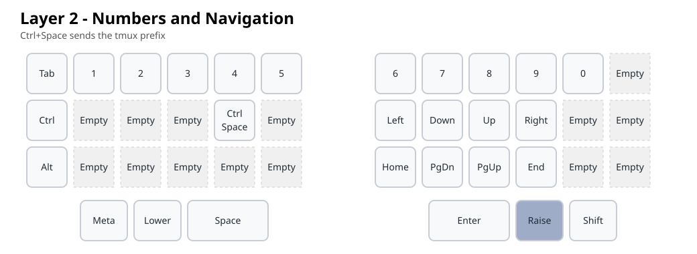
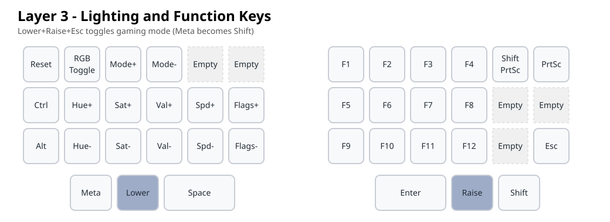

# Corne Keyboard Custom QMK Keymap

This repository contains my custom QMK keymap for the Corne (crkbd) split
keyboard. It includes advanced features like a special combos, single tmux mode
key, and a gaming mode.

The layout keeps QWERTY on the base layer, places punctuation on Lower
(`MO(1)`), navigation and numbers on Raise (`MO(2)`), and RGB controls on
`MO(3)`. Special combos include Shift+Backspace sending Delete, Shift+|
outputting ?, and the Lower+Raise+Esc chord that toggles the Meta key between
GUI and Shift for gaming mode.






## Legend

- **Meta**: Left GUI (Windows/Command) key on the thumb; toggles to Shift in
  gaming mode
- **Ctrl+Space**: Tmux prefix
- **Shift+PrtSc**: `S(KC_PSCR)` as a second screen capture option

## Features Overview

- Key Overrides
  - Shift+| = ?
  - Shift+Bksp = Delete
- Gaming Mode Toggle
  - Press Lower+Raise+Esc to toggle the Meta (GUI) thumb key between
    Windows/Command key (normal) and Shift (gaming mode).
  - In gaming mode, the Meta key becomes Shift to preventing Start menu
    activation and providing addition key binds.
- RGB Matrix Controls
  - Layer 3 provides RGB toggle, mode, hue, saturation, brightness, speed, and
    flags adjustments.
- RGB Matrix Effects
    - RGB_MATRIX_SOLID_COLOR
    - RGB_MATRIX_ALPHAS_MODS
    - RGB_MATRIX_GRADIENT_LEFT_RIGHT
    - RGB_MATRIX_CYCLE_SPIRAL
    - RGB_MATRIX_SOLID_REACTIVE_MULTIWIDE

- Layer Layouts
  - Base: QWERTY
  - Layer 1: Symbols
  - Layer 2: Numbers + Navigation
  - Layer 3: RGB + Function keys

## Layers Overview

| Layer | Description           |
|-------|-----------------------|
| 0     | Base QWERTY           |
| 1     | Symbols (punctuation) |
| 2     | Numbers + Navigation  |
| 3     | RGB Matrix + Function |

## Blackbox OLED Cockpit

The screens switch between a typing dashboard, live key maps, and lighting
controls. The illustrations show the current landscape display contents,
expanded for readability. Blue-gray marks highlighted items; the OLEDs
themselves are monochrome.

### While Typing


The **left screen** highlights active Caps/Num/Scroll Lock indicators and held
modifiers. `META:GUI` shows what the left thumb Meta key currently does; `LINK:
OK` means the two halves are communicating.

The **right screen** shows estimated words per minute, an animated reactor that
responds to typing speed, and a scrolling graph of the last 22 seconds. The
graph tops out at 160 WPM; the number can go higher.

### While Holding a Layer Key

Both screens become cheat sheets for their own half of the keyboard. The top
three lines follow the three physical rows, left to right. The bottom line
identifies the layer and side, followed by the three thumb keys. Held keys are
highlighted.

For example, holding the **Numbers + Navigation** layer shows:


`SYM` is Symbols, `NAV` is Numbers + Navigation, and `SYS` is Lighting +
Function keys. `TMX` is the tmux prefix, `ENT` is Enter, `SPC` is Space, and
`SFT` is Shift. On the System layer, `SNP` is Shift+Print Screen, `PRT` is Print
Screen, and `RST` enters the bootloader. Unassigned keys show `---`.

Release the layer key to return to the dashboard.

### Gaming Mode

The dashboard changes from **READY** to a highlighted **ARMED**, and the left
screen reads `META:SHIFT`. The reactor gains side markers. In the layer maps, a
highlighted `G` appears beside the side indicator and the Meta thumb key is
labeled `SFT` instead of `GUI`.

### While Adjusting Lighting

The right screen briefly switches to live values and gauges:


`H` is hue, `S` is saturation, `V` is brightness, and `P` is animation pace. The
header shows whether lighting is on, the current effect (`FX`), and the LED
selection (`F`). Gaming mode also adds a highlighted `ARM`.

The left screen keeps its key map visible while the System layer is held. After
2.5 seconds without another lighting adjustment, the right screen returns to its
key map or dashboard.

### When Idle

After 60 seconds without input, both screens dim, collapse toward the center,
and go dark together. Pressing or releasing a key wakes them; holding a key
keeps them awake.

## WSL Setup

Run in Ubuntu WSL with the existing Windows USB drivers.

```bash
curl -fsSL https://install.qmk.fm | sh
. "$HOME/.local/bin/env"
qmk setup -H ~/dev/qmk_firmware
git clone git@github.com:freddiehaddad/crkbd.git \
    ~/dev/qmk_firmware/keyboards/crkbd/keymaps/freddiehaddad
qmk config user.keyboard=crkbd/rev1 user.keymap=freddiehaddad
qmk doctor
```

For AVRDUDE, install `avrdude.conf` from the matching [Windows flashutils
archive](https://github.com/qmk/qmk_flashutils/releases/tag/20260711) at
`/etc/avrdude.conf`. Current bundle: `20260711`.

## Build & Flash

```bash
cd ~/dev/qmk_firmware
qmk compile --clean
```

- DFU controllers: `qmk flash --bootloader dfu`
- Other controller: `qmk flash`

## Generate keymap.json

```bash
cd ~/dev/qmk_firmware/keyboards/crkbd/keymaps/freddiehaddad
qmk c2json --keyboard crkbd/rev1 --keymap freddiehaddad --output keymap.json keymap.c
```

## Maintaining the Diagrams

- Layer and OLED illustrations live in `assets/`.
- Keep the layer keycaps and OLED legends aligned with `keymap.c`, and the
  display illustrations aligned with `blackbox.c`.
- If you export PNGs or other variants, regenerate them from the SVG source to
  keep everything in sync.

## References

- [QMK Setup](https://docs.qmk.fm/newbs_getting_started)
- [RGB Matrix](https://docs.qmk.fm/features/rgb_matrix)
- [Combos](https://docs.qmk.fm/features/combo)
- [Key Overrides](https://docs.qmk.fm/features/key_overrides)
- [QMK Configurator](https://config.qmk.fm/#/crkbd/rev1/LAYOUT_split_3x6_3)
