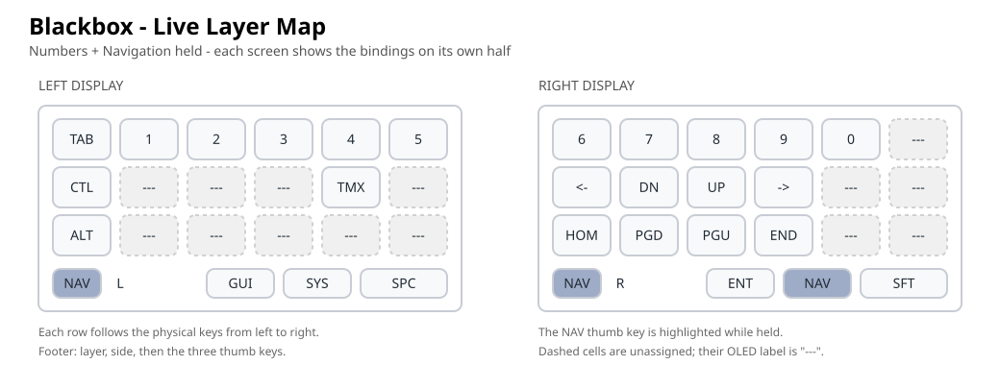

# Corne Keyboard Configuration

My QMK keymap for the Corne (`crkbd/rev1`) split keyboard.

## Layout


The **Meta** thumb key is Windows/Command, shown as `GUI` on the screens.

## Displays

The illustrations are enlarged and use blue-gray to show highlights; the OLED
screens themselves are monochrome.

### While Typing


`LINK: OK` means the two halves are communicating. Typing speed is shown in
words per minute (`WPM`); that number can exceed the graph's limit.

### While Holding a Layer Key

Hold a layer key to see the key maps. Release the layer keys to return to the
typing view.



`SYM`, `NAV`, and `SYS` are layers 1, 2, and 3. `TMX` is the tmux prefix;
`ENT`, `SPC`, and `SFT` mean Enter, Space, and Shift. On `SYS`, `SNP` is
Shift+Print Screen, `PRT` is Print Screen, and `RST` starts the bootloader for
flashing firmware.

### While Adjusting Lighting


`FX` is the current effect; `F` shows which LEDs are selected. When the values
disappear, the right screen returns to its key map or typing view.

### Gaming Mode

Gaming mode keeps the Meta key from opening the Start menu. On the typing
screens, `READY` changes to a highlighted `ARMED`, and the left screen shows
`META:SHIFT`. The animation gains side markers. Key maps show a highlighted `G`
beside the side indicator and label the Meta key `SFT`; the lighting view shows
a highlighted `ARM`.

### When Idle

After 60 seconds without input, both screens dim, play a closing animation,
and go dark together. Press or release a key to wake them; holding a key keeps
them awake.

## Setup and Flashing

### WSL Setup

Use Ubuntu on WSL with your existing Windows USB drivers.

```bash
curl -fsSL https://install.qmk.fm | sh
. "$HOME/.local/bin/env"
qmk setup -H ~/dev/qmk_firmware
git clone git@github.com:freddiehaddad/crkbd.git \
    ~/dev/qmk_firmware/keyboards/crkbd/keymaps/freddiehaddad
qmk config user.keyboard=crkbd/rev1 user.keymap=freddiehaddad
qmk doctor
```

Copy `avrdude.conf` from the same Windows flashutils bundle as your AVRDUDE
executable to `/etc/avrdude.conf`. Downloads are on the [latest release
page](https://github.com/qmk/qmk_flashutils/releases/latest).

### Build and Flash

```bash
cd ~/dev/qmk_firmware
qmk compile --clean
```

- DFU controllers: `qmk flash --bootloader dfu`
- Other controllers: `qmk flash`

## Maintenance

Key bindings live in [keymap.c](keymap.c), lighting settings in
[config.h](config.h), and screen behavior in [blackbox.c](blackbox.c).

### Export the Keymap

To create `keymap.json` for QMK Configurator:

```bash
cd ~/dev/qmk_firmware/keyboards/crkbd/keymaps/freddiehaddad
qmk c2json --keyboard crkbd/rev1 --keymap freddiehaddad --output keymap.json keymap.c
```

### Update the Diagrams

Update the illustrations in `assets/` when you change the keys or screens.
Generate any PNGs or other image formats from the SVGs so the copies stay in
sync.

## References

- [QMK Setup](https://docs.qmk.fm/newbs_getting_started)
- [RGB Matrix](https://docs.qmk.fm/features/rgb_matrix)
- [Combos](https://docs.qmk.fm/features/combo)
- [Key Overrides](https://docs.qmk.fm/features/key_overrides)
- [QMK Configurator](https://config.qmk.fm/#/crkbd/rev1/LAYOUT_split_3x6_3)
